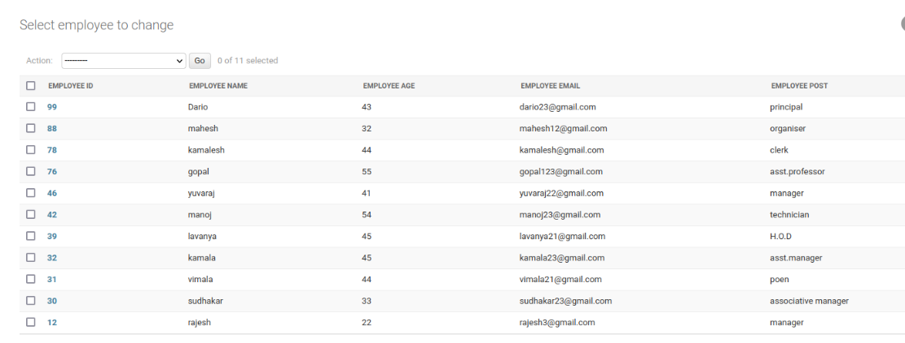

# Django ORM Web Application

## AIM
To develop a Django application to store and retrieve data from a database using Object Relational Mapping(ORM).

## Entity Relationship Diagram


## DESIGN STEPS

### STEP 1:

Created table and inserted values to it in the django applications
### STEP 2:
Implementation of python code in README.md file

### STEP 3:

Uploading the necessary files

## PROGRAM
```python
from django.db import models
from django.contrib import admin
class Employee(models.Model):
    Employee_ID = models.IntegerField(max_length=8, primary_key=True)
    Employee_Name = models.CharField(max_length=100)
    Employee_Age = models.IntegerField()
    Employee_Email =models.EmailField()
    Employee_post= models.CharField(max_length=100)

class EmployeeAdmin(admin.ModelAdmin):
    list_display = ('Employee_ID', 'Employee_Name','Employee_Age','Employee_Email','Employee_post')

```


## OUTPUT



## RESULT 
The program was executed successfully.

